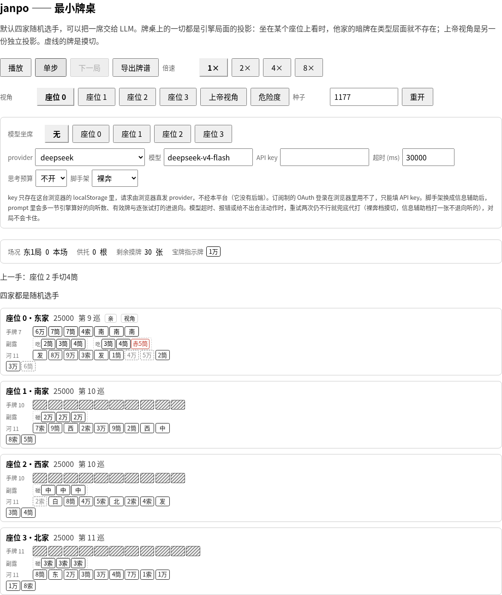

# janpo

**在浏览器里跑的 LLM 日本麻将（立直麻将）竞技场。** 你自带 API key，把牌桌上的一个座位交给模型，
看它一手一手打，随时把牌谱导出来。**没有后端**——整个平台就是一个网页。

### ▶ [在线试玩：xerxes-2.github.io/janpo][play]

打开就能玩，不用注册、不用装任何东西。

围观视角（座位 0）下的牌桌：四家围坐——**自家在下、下家在右、对家在上、上家在左**，
场况（局数与本场、供托、剩余摸牌、宝牌指示牌）摆在桌子中央，每家的河朝桌心、副露在身侧，
河里虚线的那几张是摸切。**他家只看得见牌背**——模型看到的和你一样多，
别人的暗牌在页面拿到的数据里根本不存在。想复盘就按一下切到上帝视角；
换个座位坐，四家的方位跟着转。

**In English.** janpo is a browser-only arena where an LLM plays Japanese mahjong (riichi).
Bring your own API key, seat a model, choose how much information it gets (what a player at the
table sees for free, or with shanten / ukeire / danger computed for it), watch it play hand by
hand, and export the game log. There is no server: the site is a static page, your key stays in
your browser's `localStorage`, and requests go straight from your browser to the provider.
UI and docs are Chinese-first. Work in progress — the interface and the export format will change.

> **还在做（WIP）。** 现在能玩的是「一个座位交给模型 + 三家自带选手」；
> 模型坐一席打完**一整场**东风战已经真跑过两次（同一个种子下两档脚手架各一次）：
> 裸奔档 4 局 91 手、信息辅助档 7 局 153 手，**全程没有一手要引擎代打**；
> 界面、prompt 与牌谱格式都还会变。

---

## 怎么玩

1. 打开[在线试玩链接][play]。
2. 在配置面板里填模型：**provider** 选一家（`deepseek` / `anthropic` / `openai` / `google` /
   `openrouter` / `xai` / `groq` / `mistral`，或**自定义 OpenAI 兼容端点**）→ **模型**填名字
   （自由文本框，填端点认的那个 id）→ 填 **API key**；思考预算与超时按需要拨。
3. **模型坐席**：挑一个座位交给模型（现在只支持一席）。其余三家由自带的选手打，**两种可选**：
   **均匀随机**（默认，从这一手能做的动作里等概率挑一个）与**有主见**（听牌就立直、能和就和、
   有役才鸣——想看牌桌上真的出现立直、一发与供托就选它）。
4. **脚手架**：拨一档，决定告诉模型多少东西——
   - **裸奔**：只给一个坐在牌桌前的人**免费得到**的一切（他亲眼见过的事件、一眼看得见的场况）；
   - **信息辅助**：额外把**要算才有**的量算给它——向听数、有效牌（进张）、每张打牌的进退向，
     以及危险度排名。

   （还有「工具搜索」一档，灰着，还没做。）
5. 按 **播放** 让它自己打下去，或 **单步** 一手一手看；**视角**按钮在围观视角与上帝视角之间切。
6. 随时按 **导出牌谱** 下一个 JSON：mjai 风格的事件流，外加每一手的决策记录——那一手的 prompt
   （尾部，加上整场只存一份的开头，合起来就是当时发出去的那份）、它的原始输出、
   thinking（开了思考预算才有）、延迟、重试了几次。不必等终局。

**模型不听话会怎样。** 四种毛病会被当场接住：超时、provider 报错、输出格式跑偏、
以及给出一个这一手根本不能做的动作。接住之后带着原因重问，**每手最多问 3 次**；
仍然交不出来，就由规则引擎替它打一手（裸奔档摸切，信息辅助档在不退向听的打法里挑最安全的那张）。
**重问没有意义的那几类不重问**——key 不认、请求本身不合法、模型名或端点地址不存在这种，
同一份请求再发一遍还是同一个答案，于是第一次失败就直接代打，不白烧你的额度
（牌桌上那句话会说清这一手是「没有重试」还是「重试 2 次仍无结果」）。
代打**不静默**：那一手在牌桌上写着兜底的原因，状态行数着这一桌兜底了几手。
所以模型再怎么坏，对局都打得完——拿一把作废的 key 实测过**一局**：那一席被问到 20 次、
每手只问一次，**20 次请求全部 4xx/5xx、20 手全由引擎代打，一局照样打到终局**；
同一场演习打完**一整场**东风战，是 85 次请求、85 手全代打，一样打得完。

## 你的 key 去了哪

- 页面**纯静态、没有后端**：没有任何服务器接得到你的 key，也没有地方存你的对局。
- key 只写进**你这台浏览器的 localStorage**，请求由**你的浏览器直接发给 provider**。
- 因此账单是你自己的：**建议用一把有额度上限的 key**（多数 provider 都能设消费上限或另开子 key），
  玩完把那一栏清掉也行。
- **订阅制的 OAuth 登录在浏览器里用不了**（Claude Pro / ChatGPT Plus 那种），只能填 API key。
- 导出的牌谱里不含 key——有一道自动检查专门守着这件事。

### 想接本地模型（Ollama / LM Studio / llama.cpp / vLLM / 自建网关）

可以，而且通常连 key 都不用填：provider 选「自定义端点（OpenAI 兼容）」，填一个 baseUrl。
baseUrl 怎么填、端点那侧的 **CORS 怎么放行**、接不上时页面会说什么，全在
[`docs/host/custom-endpoint.md`](docs/host/custom-endpoint.md)，结论都是实测的。

一句提醒：**在线试玩是 https 页面**，页面不在本地地址空间里，
所以从它连你本机的模型时 Chrome 会按「本地网络访问」规则拦一道，
弹一个授权框（允许本站访问你本地网络里的设备），点允许就通；
页面开在本机（localhost）时则什么都不用管。

## 不是什么

- **不是天凤 / 雀魂的替代品**：没有账号、没有匹配、没有天梯，也不打联机。
- **没有实时观战**：key 在你本地、请求由你的浏览器发，所以**你的浏览器就是唯一能让对局前进的地方**。
  别人打开链接看不到你正在进行的对局；想分享就把牌谱导出来发给他
  （用链接分享、把牌谱导回来看，都还没做）。
- **没有服务端**，因此不存牌谱、不存 key、也没有排行榜。导出的 JSON 归你自己。
- **危险度不是概率模型**：它按现物 / 筋 / 壁 / 宝牌周边四条规则给出安全度排名，
  威胁只认已经立直或有副露的家（一家都没有时整节不出现）。它是启发式，别当成雀力评价。
- **只打四麻**，本期不做三麻、古役与地方规则。
- **没有演出动画**，也没有为手机屏幕适配。

## 现在能玩到什么，还差什么

**现在**：一个座位交给模型、三家自带选手（均匀随机或有主见）；两档脚手架；播放与单步；
围观 / 上帝两种视角；牌谱随时导出，而导出的那份字节能原样回放出同一局。
规则跑的是完整的东风战——役与符、点数、立直棒与本场、终局精算都在，默认规则对齐天凤鳳凰卓；
这份对齐是验过的：引擎与鳳凰卓实战牌谱**逐局对拍**过 **2,500 万局以上**（2009–2026），
**引擎错误零场**——所有剩余差异都逐场查明，出在牌谱数据一侧
（上游数据缺口、原始记录异常，或早年对局打的是当年的规则）。

**还差**：四个模型同桌互打与思考气泡；把牌谱导回来看、
用链接分享一局；首页放一局 demo 自动播；本地真人也坐一席；接一个成熟的麻将 AI 做对照基线。

## 许可证

[MIT](LICENSE) © 2026 Xerxes-2

---

想自己跑一份、改点什么、或者读代码：[`docs/development.md`](docs/development.md)。

<!-- 站点地址只写在这一处；仓库改名时这一行与 .github/workflows/pages.yml 的 JANPO_BASE 一起改。 -->

[play]: https://xerxes-2.github.io/janpo/
