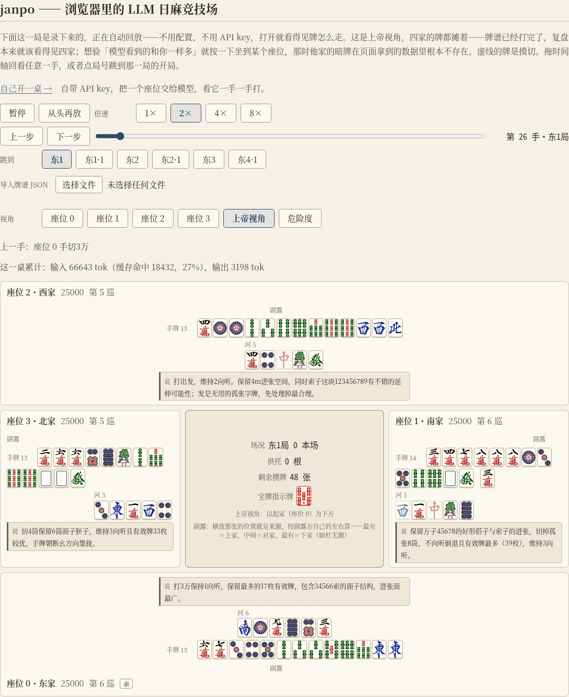

# janpo

**在浏览器里跑的 LLM 日本麻将（立直麻将）竞技场。** 你自带 API key，把牌桌上的座位交给模型
（一席、两席，四家全是模型也行），看它们一手一手打，随时把牌谱导出来。
**没有后端**——整个平台就是一个网页。

### ▶ [在线试玩：xerxes-2.github.io/janpo][play]

打开就能玩，不用注册、不用装任何东西。**第一眼就是一桌牌在走**——首页放的是一局
随站点分发的录像（东风战，四家自带选手），不用配置、不用 key；想自己开一桌就点
「自己开一桌」，那一页（`?table=1`）才是下面这些配置面板。

首页：Demo 牌谱自动回放。**默认上帝视角**——牌谱已经打完了，复盘本来就该看得见四家；
控制条下面那一根是**时间轴**：拖到哪里牌桌就是那一手，旁边两枚按钮逐手步进，
再下一排的局号一点就跳到那一局的开局。

主持人那一页（`?table=1`）：四家围坐的牌桌——**自家在下、下家在右、对家在上、上家在左**，
左右两家的牌像真牌桌一样**侧着摆成一列**；场况（局数与本场、供托、剩余摸牌、宝牌指示牌）
摆在桌子中央，每家的河朝桌心、副露在身侧，河里虚线的那几张是摸切，
名牌上写着这一席交给了谁（哪份模型档案、什么脚手架档位，或者自带 bot 的那两档）。
两页都**默认上帝视角**；按一下「座位 N」坐下去，**他家就只看得见牌背**
——模型看到的和你一样多，别人的暗牌在页面拿到的数据里根本不存在；四家的方位也跟着转。

**In English.** janpo is a browser-only arena where an LLM plays Japanese mahjong (riichi).
Bring your own API key, seat a model, choose how much information it gets (what a player at the
table sees for free, or with shanten / ukeire / danger computed for it), watch it play hand by
hand, and export the game log. You can also take a seat yourself, or seat the **strong AI
baseline**: Akagi's [`native_bot`](https://github.com/shinkuan/Akagi) (Apache-2.0, © 2026 Shinkuan,
source commit `394b3290`), a pure-Rust mahjong CNN behavior-cloned from human Tenhou logs that we
ship as a ~6 MB WebAssembly module and run **inside your browser** — see the third-party notice for
its license and for what we could not verify about its training data.
There is no server: the site is a static page, your key stays in
your browser's `localStorage`, and requests go straight from your browser to the provider.
UI and docs are Chinese-first. Work in progress — the interface and the export format will change.

> **还在做（WIP）。** 现在能玩的是「四个座位各自挑一个选手：均匀随机 / 有主见 / 某份模型档案 /
> 你自己（本地真人坐一席）/ 强 AI 基线」；
> 模型坐一席打完**一整场**东风战已经真跑过两次（同一个种子下两档脚手架各一次）：
> 裸奔档 4 局 91 手、信息辅助档 7 局 153 手，**全程没有一手要引擎代打**；
> 界面、prompt 与牌谱格式都还会变。

---

## 怎么玩

1. 打开[在线试玩链接][play]，点页面顶上那条「自己开一桌」（也就是 `?table=1`）。
2. 建一份**模型档案**（面板下半截那一排「模型档案」）：给它起个名字，**provider** 选一家
   （`deepseek` / `anthropic` / `openai` / `google` / `openrouter` / `xai` / `groq` / `mistral`，
   或**自定义 OpenAI 兼容端点**）→ **模型**填名字（自由文本框，填端点认的那个 id）→ 填 **API key**；
   思考预算与超时按需要拨。**key 只在这里填一次**：一把 key 坐几席都不必重填。
3. **四个座位各挑一个选手**：每一席可以是**均匀随机**（默认，从这一手能做的动作里等概率挑一个）、
   **有主见**（听牌就立直、能和就和、有役才鸣——想看牌桌上真的出现立直、一发与供托就选它），
   或者**某一份模型档案**。四家都挑档案就是**四 LLM 同桌**；同一份档案坐两席、两席给不同的人格，
   就是一场只差人格这一个变量的对照实验。还有两种选手与它们并排：**「我自己」**（你亲自坐一席，
   牌桌下面多一排按钮）与**强 AI 基线**（在你浏览器里跑的一个麻将 CNN，下面有一节专说它）。
4. **脚手架 / 人格 / 模板**：这三样**按座位各拨各的**（在那一席自己那一行上）。脚手架决定
   告诉模型多少东西——
   - **裸奔**：只给一个坐在牌桌前的人**免费得到**的一切（他亲眼见过的事件、一眼看得见的场况）；
   - **信息辅助**：额外把**要算才有**的量算给它——向听数、有效牌（进张）、每张打牌的进退向，
     以及危险度排名；
   - **工具搜索**：不把那几个数直接摆给它，而是给它一个工具，让它自己挑一张牌去问
     「打这张之后会怎样」（引擎回同一套数），**一手最多问 4 次**，问满就没了；
     它查了什么、查了几次都落在那一手的 prompt 里，点开气泡就能读到。
5. **配桌**：**对局长度**（东风战 / 半庄战）、**赤宝牌**（有 / 无）与**食断**（有 / 无）三项在牌桌上面拨，
   **拨完要按「重开」才生效**（与种子同一条路——半场换规则的话，同一份牌谱前后按两套规则算，就再也重现不了）。
6. 按 **播放** 让它自己打下去，或 **单步** 一手一手看；**视角**按钮在四个座位与上帝视角之间切
   （默认上帝视角：四家的牌都摊着；坐到某个座位上就只看得见那一席的暗牌与它的思考气泡）。
7. 随时按 **导出牌谱** 下一个 JSON：mjai 风格的事件流，外加每一手的决策记录——那一手的 prompt
   （尾部，加上整场只存一份的开头，合起来就是当时发出去的那份）、它的原始输出、
   thinking（开了思考预算才有）、延迟、重试了几次。不必等终局。

**模型不听话会怎样。** 四种毛病会被当场接住：超时、provider 报错、输出格式跑偏、
以及给出一个这一手根本不能做的动作。接住之后带着原因重问，**每手最多问 3 次**；
仍然交不出来，就由规则引擎替它打一手（裸奔档摸切，信息辅助档在不退向听的打法里挑最安全的那张）。
**重问没有意义的那几类不重问**——key 不认、请求本身不合法、模型名或端点地址不存在这种，
同一份请求再发一遍还是同一个答案，于是第一次失败就直接代打，不白烧你的额度
（牌桌上那句话会说清这一手是「没有重试」还是「重试 2 次仍无结果」）。
代打**不静默**：那一手在牌桌上写着兜底的原因，状态行数着这一桌兜底了几手。
所以模型再怎么坏，对局都打得完——拿一把作废的 key 实测过**一局**：那一席被问到 20 次、
每手只问一次，**20 次请求全部 4xx/5xx、20 手全由引擎代打，一局照样打到终局**；
同一场演习打完**一整场**东风战，是 85 次请求、85 手全代打，一样打得完。

## 你的 key 去了哪

- 页面**纯静态、没有后端**：没有任何服务器接得到你的 key，也没有地方存你的对局。
- key 只写进**你这台浏览器的 localStorage**，请求由**你的浏览器直接发给 provider**。
- 因此账单是你自己的：**建议用一把有额度上限的 key**（多数 provider 都能设消费上限或另开子 key），
  玩完把那一栏清掉也行。
- **订阅制的 OAuth 登录在浏览器里用不了**（Claude Pro / ChatGPT Plus 那种），只能填 API key。
- 导出的牌谱里不含 key——有一道自动检查专门守着这件事。

### 想接本地模型（Ollama / LM Studio / llama.cpp / vLLM / 自建网关）

可以，而且通常连 key 都不用填：provider 选「自定义端点（OpenAI 兼容）」，填一个 baseUrl。
baseUrl 怎么填、端点那侧的 **CORS 怎么放行**、接不上时页面会说什么，全在
[`docs/host/custom-endpoint.md`](docs/host/custom-endpoint.md)，结论都是实测的。

一句提醒：**在线试玩是 https 页面**，页面不在本地地址空间里，
所以从它连你本机的模型时 Chrome 会按「本地网络访问」规则拦一道，
弹一个授权框（允许本站访问你本地网络里的设备），点允许就通；
页面开在本机（localhost）时则什么都不用管。

## 那个「强 AI 基线」是什么，来自哪里

四席里除了 bot、模型档案与「我自己」，还有一种选手叫**强 AI 基线**。
它是 [shinkuan/Akagi](https://github.com/shinkuan/Akagi) 的 `native_bot`（来源 commit `394b3290`，
**Apache-2.0，© 2026 Shinkuan**）——一个纯 Rust 的麻将 CNN（candle 推理，
**行为克隆自人类天凤牌谱**）；我们把它编成一份约 6 MB 的 WebAssembly（模型权重内嵌在里面），
**在你的浏览器里推理**，不经任何后端。它在这个平台上的用处是**当尺子**：
同一张牌桌上模型（或你自己）打得怎么样，跟它比。

**只有把某一席拨给它，浏览器才会去下那几 MB**：首页与不选它的对局一个字节都不下；
拉不动就那一席退回自带 bot、其余席照常把这一局打完（页面会直说是为什么）。
它**不会说话**：没有思考气泡、没有 token 账单，复盘里只摆得出它那一手打了什么。

**许可，以及一条没消的风险。** 上游的代码与权重按 Apache-2.0 分发，
那份 `LICENSE` 与 `NOTICE` 随站点一起发（页脚那条「第三方组件声明」，源文件在
[`web/public/third-party/README.md`](web/public/third-party/README.md)）；
但**权重具体用哪一份天凤牌谱训出来的，上游没有公开，我们无从核**
——Apache-2.0 授权的是上游对代码与权重文件本身的权利，不代表牌谱的权利人授权过什么。
我们照原样分发，并把这条风险明写在那份声明与
[`probe/akagi-wasm/NOTICE-upstream.md`](probe/akagi-wasm/NOTICE-upstream.md)（逐条出处在那里）里。

## 不是什么

- **不是天凤 / 雀魂的替代品**：没有账号、没有匹配、没有天梯，也不打联机。
- **没有实时观战**：key 在你本地、请求由你的浏览器发，所以**你的浏览器就是唯一能让对局前进的地方**。
  别人打开你用「复制分享链接」发给他的地址，看到的是到复制那一刻为止的**回放**，
  不是实时牌桌；链接只带棋谱（推理不上 URL），完整推理要用「导出牌谱」的 JSON 文件给他、
  从首页的「导入牌谱 JSON」导回来看。
- **没有服务端**，因此不存牌谱、不存 key、也没有排行榜。导出的 JSON 归你自己。
- **危险度不是概率模型**：它按现物 / 筋 / 壁 / 宝牌周边四条规则给出安全度排名，
  威胁只认已经立直或有副露的家（一家都没有时整节不出现）。它是启发式，别当成雀力评价。
- **只打四麻**，本期不做三麻、古役与地方规则。
- **没有演出动画**，也没有为手机屏幕适配。

## 现在能玩到什么，还差什么

**现在**：四个座位各挑一个选手——**均匀随机 / 有主见**两种自带 bot、**某一份模型档案**
（四家都可以是模型）、**「我自己」**与**强 AI 基线**，四种随便混；
**三档脚手架**（裸奔 / 信息辅助 / 工具搜索）、人格与模板按座位各拨各的；播放与单步；
围观 / 上帝两种视角；牌谱随时导出，而导出的那份字节能原样回放出同一局；
首页就是一局录像在自动播（时间轴拖得动），模型坐席的每一手在牌桌上有思考气泡；
牌谱 JSON 导得回来看，「复制分享链接」能把一局装进一条地址——链接只带棋谱，完整推理在导出的 JSON 里。
**你自己坐下也能把一整场打完**：点手里的牌就打出去，吃碰杠、立直、荣和自摸与九种九牌各是一枚按钮，
而**按钮只在这一手真能做时才出现**（于是你没得犯规）；拨到信息辅助档时给你看的
向听 / 有效牌 / 危险度，与模型 prompt 里那几个数是**同一次计算**；思考时限按座位配
（默认不限时，到点替你打一张并说明白）；有真人在座时对局中不给他看别家的气泡与暗牌，**终局才解锁**。
**终局之后有逐手复盘**：坐到哪一席就看哪一席（模型席也看得了），那一席每一手一条标注
（向听、有效牌、危险度、有没有更好的打法）；再按一枚按钮还能把**强 AI 基线那一手**并排列出来（那几 MB 到这一步才下）。
规则跑的是完整的东风战——役与符、点数、立直棒与本场、终局精算都在，默认规则对齐天凤鳳凰卓；
这份对齐是验过的：引擎与鳳凰卓实战牌谱**逐局对拍**过 **2,500 万局以上**（2009–2026），
**引擎错误零场**——所有剩余差异都逐场查明，出在牌谱数据一侧
（上游数据缺口、原始记录异常，或早年对局打的是当年的规则）。

**还差**：强 AI 基线只报它打哪张，**给不出理由**（想读推理只能看模型席）；
真人席拨到「工具搜索」时按信息辅助处理（没给人做那个查询面板）；
**三档脚手架 × 多个模型的成套对照实验还没人跑**——现在只有每档几局的单场记录，
谈不上胜率与雀力结论；没有账号、匹配、天梯与联机（那几样也不打算做，见上面「不是什么」）。

## 许可证

[MIT](LICENSE) © 2026 Xerxes-2

---

想自己跑一份、改点什么、或者读代码：[`docs/development.md`](docs/development.md)。

<!-- 站点地址只写在这一处；仓库改名时这一行与 .github/workflows/pages.yml 的 JANPO_BASE 一起改。 -->

[play]: https://xerxes-2.github.io/janpo/
